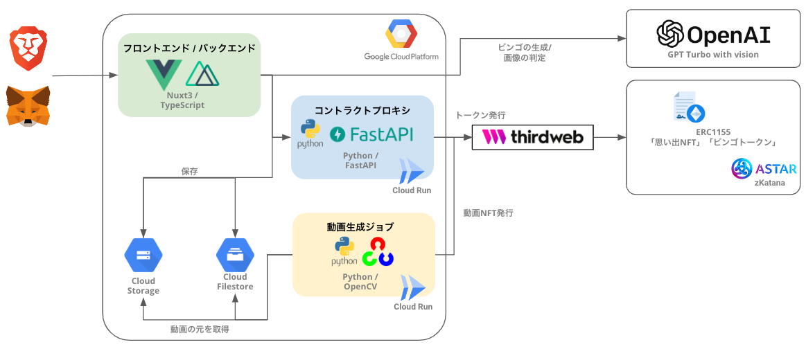

[](https://github.com/teritamas/key3-global-hackathon/actions/workflows/firebase-hosting-merge.yml)

# Sotomiru

- [デモページ](https://key3-global-hackathon.web.app/)

## 全体構成

Sotomiru の全体構成は下記の通り。



全体構成で色付きの部分は、本リポジトリで管理している。

| 色  | アプリ名             | 概要                                      | ソースのパス                                                                                                         |
| --- | -------------------- | ----------------------------------------- | -------------------------------------------------------------------------------------------------------------------- |
| 緑  | Web サーバ           | 本アプリケーションの Web 画面             | 本リポジトリのルート                                                                                                 |
| 青  | コントラクトプロキシ | ThirdWeb にリクエストするプロキシサーバ。 | [`functions/contract_proxy`](https://github.com/teritamas/Sotomiru/tree/main/functions/contract_proxy)               |
| 黄  | 動画生成ジョブ       | 動画を生成し動画 NFT を発行するジョブ     | [`functions/create_complete_movie`](https://github.com/teritamas/Sotomiru/tree/main/functions/create_complete_movie) |

> Note: コントラクトジョブは、Web サーバの Nuxt3 と ThirdWebSDK の相性が悪く、現時点では 一緒に動作させることができないため、別のサーバで動作させるために存在している。

> Note: 動画生成ジョブは、動画生成に非常に時間がかかるため、別プロセスのジョブとして実装している。また Python を利用した理由は、nodeJs に動画生成に使いやすいライブラリが存在しなかったため、Python で実装している。

NFT とトークンの発行に利用するコントラクトは、ThirdWeb を利用して Aster の Testnet である Zkatana にデプロイしている。

- [Sotomiru Bingo Contract の Chain Explorer](https://zkatana.blockscout.com/address/0xdE430c046381D1814b678e9fF0f3f027A3D3Ac23)

## Quick Start

### 1. 必要情報の取得

はじめに下記のサービスにアクセスし、利用に必要な情報を取得する。API キーやアカウントが存在しない場合は作成する。

| サービス名     | URL                               | 必要な情報                                                                                                                                                                                                                        |
| -------------- | --------------------------------- | --------------------------------------------------------------------------------------------------------------------------------------------------------------------------------------------------------------------------------- |
| OpenAI         | https://beta.openai.com/          | API キー                                                                                                                                                                                                                          |
| Google Cloud   | https://console.cloud.google.com/ | サービスアカウントキー, バケット名                                                                                                                                                                                                |
| Wallet Connect | https://walletconnect.org/        | プロジェクトを新規作成する。その後「プロジェクト ID 」を取得                                                                                                                                                                      |
| ThirdWeb       | https://thirdweb.net/             | API キーを発行し、「クライアント ID」 と 「API キー」を取得。<br> その後 ERC1155 のコントラクトをデプロイし、その「コントラクトアドレス」を取得。<br>上記のコントラクトをデプロイする時に利用した「ウォレットの秘密鍵」を取得する |

#### 1-1. `.env`の作成

`.env.example`をコピーして、`.env`を作成する。その後、それぞれのサービスから取得した情報を`.env`に設定する。

```bash
# Generative AIの設定
OPENAI_API_KEY=${OpenAIのAPIキー}

# GCPの設定
GOOGLE_APPLICATION_CREDENTIALS=${GCPのサービスアカウントキーのパス}
FIRE_STORAGE_BUCKET=${fire storageのバケット名}

# Firebase Authenticationの設定
FIREBASE_API_KEY=${firebaseのAPIキー}
FIREBASE_AUTH_DOMAIN=${firebaseの認証ドメイン}
FIREBASE_PROJECT_ID=${firebaseのプロジェクトID}
FIREBASE_MESSAGING_SENDER_ID=${firebaseのメッセージング送信者ID}
FIREBASE_APP_ID=${firebaseのアプリID}
FIREBASE_MEASUREMENT_ID=${firebaseの測定ID}

# Wallet Connectの設定
WALLET_CONNECT_PROJECT_ID=${wallet connectのプロジェクトID}

# thirdwebの設定
THIRD_WEB_CLIENT_ID=${Third WebのAPIクライアントID}
THIRDWEB_API_KEY=${Third WebのAPIキー}
THIRDWEB_SIGNER_PRIVATEKEY=${上記のコントラクトをデプロイしたクライアントの秘密鍵}
ERC1155_CONTRACT_ADDRESS=${利用するコントラクト}
BINGO_TOKEN_ID=${ERC1155_CONTRACT_ADDRESSのうち、ビンゴトークンのID}

# Backend API Endpoint
CONTRACT_PROXY_API_ENDPOINT=${コントラクトプロキシのエンドポイント、ローカルで動作確認する場合は http://localhost:8080を指定する。}
```

### 2. サーバの起動

必要ライブラリをインストール。

```bash
npm install
```

開発用サーバを起動する。

```bash
npm run dev
```

ThirdWeb の プロキシサーバと動画生成ジョブを起動する。(初回はビルドに 30 分程度かかる)

```bash
docker compose up -d
```

プロキシサーバは常時起動する。動画生成ジョブは、動画生成が必要な場合に随時起動する。動画生成ジョブのみの起動は、下記のコマンドで行う。

```bash
docker compose up -d create_complete_movie
```

#### 2-1. デプロイ環境の起動

デプロイ環境の起動は、下記のコマンドで行う。

```bash
npm run preview
```

## デプロイ

### 1. Cloud Run の設定

コントラクトプロキシと動画生成ジョブは Cloud Run にデプロイする。

デプロイ手順は随時記載する。

デプロイ後、コントラクトプロキシのエンドポイントを、GithubAction のシークレットの`CONFIG_VALUES`の`CONTRACT_PROXY_API_ENDPOINT`に設定する。

### 2. CI/CD の設定

Web アプリケーションは、Firebase Hosting と Function にデプロイされている。Github のリポジトリのシークレットに以下の環境変数を設定する。

| 環境変数名               | 説明                                               |
| ------------------------ | -------------------------------------------------- |
| FIREBASE_SERVICE_ACCOUNT | サービスアカウントを json を base64 に変換したもの |
| CONFIG_VALUES            | 以下の手順で作成したシークレット情報               |

CONFIG_VALUES には、アプリの起動に必要な環境変数を設定する。`.env`の内容から`GOOGLE_APPLICATION_CREDENTIALS`を除いた内容をを設定する。

### 3. サービスアカウントの設定

Firebase のコンソールからサービスアカウントを発行した場合、発行したサービスアカウントに以下の権限を追加で付与する。

- Cloud Functions Developer
- Firebase Hosting Admin
- Service Account User

設定が完了後、Github Actions により自動的に検証環境にデプロイされる。
